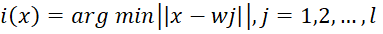
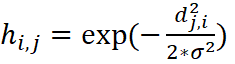
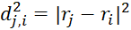
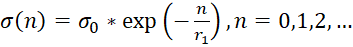
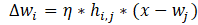
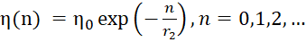

# Kohonen_Self-Organizing_maps
SOM is an artificial neural network based on learning without a teacher. In self-organization maps, neurons are placed at the nodes of the lattice, usually one- or two-dimensional. All neurons of this lattice are connected to all nodes of the input layer.

#### SOM Learning Algorithm
Step 1: Initialization. For all synaptic weight vectors,

,

where l – total number of neurons, m – dimension of the input space, a random value from -1 to 1 is selected.

Step 2: Subsampling. Select the vector X = [x1, x2, ..., xm] from the input space.

Step 3: Search for the winning neuron or the competition process. Find the most suitable (winning neuron) i(x) in step n using the minimum Euclidean distance criterion:

.

Step 4: The process of cooperation. Find the topological neighborhood hij of the winning neuron centered at i by the Gauss function:

,

where σ is the effective width. The lateral distance is defined as:

,

where rj is the position of the excited neuron, ri is the position of the winning neuron.

SOM is characterized by a decrease in the topological neighborhood in the learning process. This can be achieved by changing σ according to the formula:

,

where r1 is the constant 1000 / log(σ0), n is the learning step, σ0 is the initial value of σ, approximately equal to the radius of the lattice.

The function hij at the end of the training phase should cover only the nearest neighbors.

Step 5: The Adaptation Process. The change in the vector of neuron weights in the lattice can be expressed as follows:

,

where η is the parameter of the learning rate.

It is also recommended to change the learning speed parameter depending on the step in the SOM learning algorithm:

,

where r2 is the constant of the algorithm, r2 = 1000. η0 = 0.1, while it should not fall below the value of 0.01.

After updating the weights, we return to step 2 and so on.

As an example of the work of Kohonen's self-organizing maps – the task of classifying irises. The data set contains 3 classes of 50 samples in each, where each class belongs to the type of iris.

##### Attribute Information:

1. sepal length in cm
2. sepal width in cm
3. petal length in cm
4. petal width in cm
5.class: Iris Setosa, Iris Versicolour, Iris Virginia.

A 6x6 network was set. As a rule, the number of iterations sufficient for the convergence stage can exceed the number of neurons in the network by 500 times, so the number of iterations was set at 500 * 6 * 6. The relation to the class of the input vector was marked by color. Neurons fall into black, which were not winners in any iteration.
